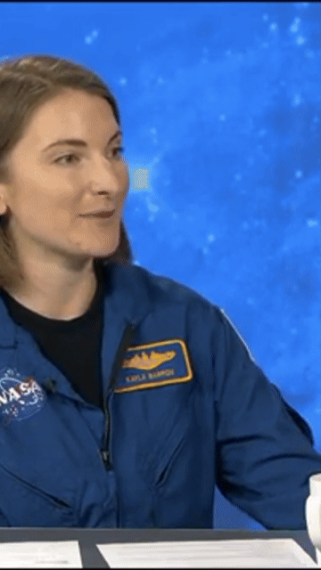

# AutoClip AI 🎬

> Turn long-form podcasts, interviews, and lectures into viral 9:16 vertical shorts — automatically, using AI to find the best moments.

AutoClip AI is an open-source pipeline that ingests a long-form video and outputs ready-to-post vertical clips (TikTok / Reels / YouTube Shorts) with AI-selected viral moments and burned-in, karaoke-style dynamic captions. No manual scrubbing through hours of footage, no manual subtitle timing.

Built as a **€0-infrastructure, fully open-core** project — the entire processing pipeline runs on free-tier APIs and open tooling, no paid cloud compute required.

---




*Real output from the pipeline — NASA's "Houston We Have a Podcast" episode automatically clipped, cropped to 9:16, and captioned, zero manual editing.*


## ✨ What it does

Give it a video. It will:

1. **Extract the audio** locally via `ffmpeg`.
2. **Transcribe it** with word-level timestamps (Groq Whisper API).
3. **Analyze the full transcript with an LLM** to find the most compelling, standalone-viable moments — scored for virality, with a generated headline and reasoning for each pick. Scales to any video length (tested on podcasts up to 2.5+ hours) via automatic transcript chunking.
4. **Generate the final clips**: trims to the exact moment, crops to 9:16 vertical, and burns in word-by-word karaoke-highlighted captions — fully rendered, ready to upload.

All from one command:

```bash
python3 src/main.py --input your_video.mp4 --clips 3
```
## 🧠 Why this exists

Most auto-clipping tools are either:

- Expensive subscription SaaS ($18-99/month) built for agencies, or
- Free but "dumb" (just center-crops + generic captions, no real moment selection)

AutoClip AI focuses specifically on moment selection quality — using an LLM to actually read and understand the transcript, not just detect audio volume spikes or keyword density. It's built in the open so anyone can inspect, improve, or self-host it, with a managed/hosted version planned for people who just want results without running code.

## 🏗️ Architecture

```
Input video (.mp4)
       │
       ▼
┌─────────────────────┐
│  audio_extractor.py │  ffmpeg: strip audio -> mono 16kHz mp3
└─────────────────────┘
       │
       ▼
┌─────────────────────┐
│   transcriber.py    │  Groq Whisper API -> word-level timestamps
│                     │  (auto-chunks files >25MB)
└─────────────────────┘
       │
       ▼
┌─────────────────────┐
│  hook_detector.py   │  LLM analyzes transcript (chunked for long
│                     │  content) -> top N viral segments as
│                     │  validated JSON (Pydantic schema)
└─────────────────────┘
       │
       ▼
┌─────────────────────┐
│  video_clipper.py   │  ffmpeg: trim -> 9:16 crop -> generate ASS
│                     │  karaoke captions -> burn in -> encode mp4
└─────────────────────┘
       │
       ▼
   Final vertical clips, ready to post
```

### Tech stack:

- **FFmpeg** — all video/audio processing (local, free, zero cloud compute cost)
- **Groq API** — both transcription (Whisper-large-v3-turbo) and hook detection (gpt-oss-120b), chosen for generous free-tier limits and speed
- **Pydantic** — strict schema validation on all LLM output, so the pipeline never breaks on malformed AI responses
- **Python 3.11+**

## 🚀 Setup

### Prerequisites
- Python 3.11+
- `ffmpeg` installed and on your system `PATH`
- A free Groq API key

### Installation

```
git clone https://github.com/HackerDpro/autoclip-ai.git
cd autoclip-ai
pip install -r requirements.txt
```

### Configuration
Copy the example environment file and add your API key:

```
cp .env.example .env
```

### Edit `.env`:

```
GROQ_API_KEY=your_groq_api_key_here
GROQ_LLM_MODEL=openai/gpt-oss-120b
```

### Running it

```
python3 src/main.py --input path/to/your/video.mp4 --clips 3
```
Output clips land in `data/output/`.

**Tip:** if you're iterating on captions/cropping and don't want to re-transcribe every time (saves API usage), reuse a cached transcript:

```
python3 src/main.py --input video.mp4 --clips 3 --transcript-cache data/temp/video_transcript.json
```

## ⚠️ Current limitations (honest, not hidden)
- **Center-crop only** — works best on single-speaker, centered-subject footage (solo podcasts, talking-head/webcam-style videos). Multi-person side-by-side layouts or videos with existing baked-in subtitles near the bottom of frame will crop poorly. Smart content-aware cropping (face/speaker tracking) is a planned v2 feature.
- **No YouTube URL ingestion yet** — currently file-based input only (.mp4, etc). Direct YouTube downloading is being evaluated for a future version.
- **English-first prompt tuning** — hook detection prompts are currently optimized for English transcripts; multilingual tuning (Dutch/French) is planned.


## 🗺️ Roadmap

 - Smart content-aware cropping (face/active-speaker detection)
 - YouTube URL direct ingestion
 - Multilingual hook-detection prompt tuning (Dutch/French)
 - Simple web UI wrapper (upload video, download clips, no CLI needed)
 - Hosted/managed version for non-technical users

## 🤝 Contributing

This is an open-core project — core pipeline improvements, bug fixes, and feature PRs are welcome. Open an issue first for larger changes so we can discuss approach.

## 📄 License
MIT — see LICENSE.

## 👤 About
Built by **Diego**, a 15-year-old developer based in Belgium, as a €0-budget proof that solid engineering + free-tier APIs can produce a genuinely useful AI product without any infrastructure spend.